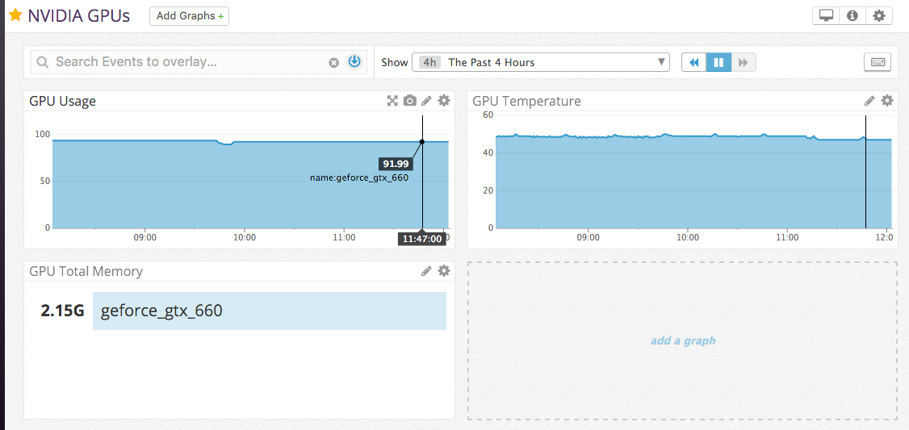

# datadog_nvml

Monitoring NVIDIA GPUs status using Datadog

`Datadog` による NVIDIAのGPUの状態をモニタリングするための `Agent Check` スクリプトです．
`nvidia-ml-py` モジュールを利用しています．



## 現在のモニタ項目

現在は以下の項目についてGPU毎に取得します．

### Metrics

- nvml.util.gpu: Percent of time over the past sample period during which one or more kernels was executing on the GPU.
- nvml.util.memory:  Percent of time over the past sample period during which global (device) memory was being read or written.
- nvml.mem.total: トータルメモリ
- nvml.mem.used: 使用中メモリ
- nvml.mem.free: 空きメモリ
- nvml.temp: 温度

### Tags

- name: GPU名(例: GEFORCE_GTX_660)


# REQUIRES

nvidia-ml-py モジュールが必須です．

- https://pypi.python.org/pypi/nvidia-ml-py

```
$ sudo /opt/datadog-agent/embedded/bin/pip install nvidia-ml-py
```

# SETUP

二つのファイルを `/etc/dd-agent` ディレクトリの `checks.d, conf.d` ディレクトリにコピーします．

- nvml.py: /etc/dd-agent/checks.d
- nvml.yaml.default: /etc/dd-agent/conf.d

```
$ git clone https://github.com/ngi644/datadog_nvml.git
$ cd datadog_nvml
$ sudo cp nvml.py /etc/dd-agent/checks.d
$ sudo cp nvml.yaml.default /etc/dd-agent/conf.d
```

Datadogを再起動します．

```
$ sudo service datadog-agent restart
```


# References

- https://pypi.python.org/pypi/nvidia-ml-py/
- http://pythonhosted.org/nvidia-ml-py/
- http://docs.datadoghq.com/guides/agent_checks/
